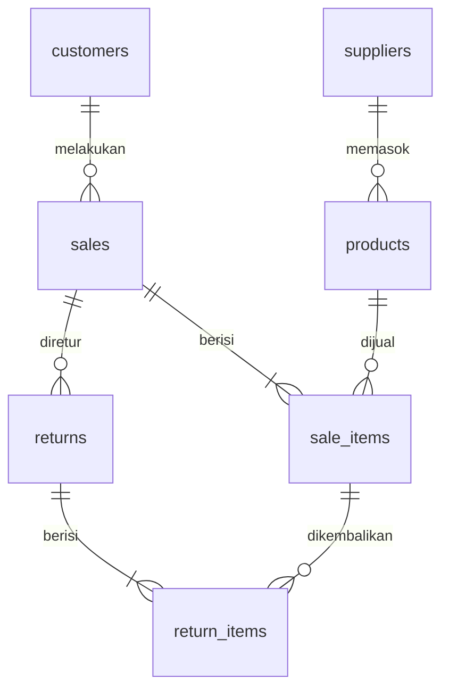

# Gadgetku

Aplikasi penjualan dan retur gadget sederhana tanpa library tambahan. Klik dua kali `frontend/index.html` untuk membuka aplikasi dan mengakses Supabase langsung dari browser, tanpa localhost, Node.js, atau Live Server. Browser perlu koneksi internet.

```text
backend/   app.js, supabase.js
frontend/  index.html, styles.css, app.js
database/  schema.sql
```

Database memiliki tujuh entitas: `customers`, `suppliers`, `products`, `sales`, `sale_items`, `returns`, dan `return_items`. Setiap produk terhubung ke satu pemasok.

## Membuka aplikasi

Klik dua kali `frontend/index.html`. Status sidebar harus menampilkan “Supabase terhubung”. Jika tidak tersambung, transaksi tidak disimpan lokal dan aplikasi menampilkan status koneksi.

## Persiapan Supabase

Jalankan seluruh isi `database/schema.sql` satu kali di Supabase SQL Editor. `frontend/app.js` mengakses REST/RPC Supabase memakai project URL dan publishable key. Backend tetap tersedia di `backend/`, tetapi tidak digunakan dalam mode klik-ganda.

**Keamanan:** project saat ini menunjukkan RLS nonaktif. Dengan RLS nonaktif, data tabel dapat dibaca/diubah pihak lain yang mengetahui URL project dan publishable key. Sebelum dipakai untuk data nyata, aktifkan RLS dan autentikasi/policies yang membatasi akses. Jangan pernah memasukkan service-role/secret key ke frontend.

Transaksi yang sebelumnya hanya ada di `localStorage` tidak otomatis dipindahkan ke Supabase; transaksi baru setelah status “Supabase terhubung” akan tersimpan di database.

## ERD

